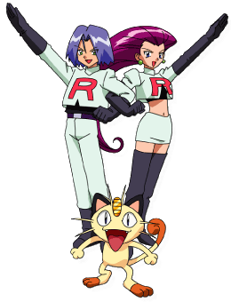

<div align="center">

  

  <br />
  <br />

  <div style="display: inline-block;">
    
    
    
    
    
  </div>

  <br />
  <br />

  <a href="https://memory-game-zeta-hazel.vercel.app/">
    
  </a>

  <br />
  <br />

  <a href="https://memory-game-zeta-hazel.vercel.app/">
    
  </a>

  <br />
  <br />

  

</div>

---

## 💻 Sobre o Projeto

O **Memory Game** não é apenas um jogo, é uma demonstração de uma aplicação **Full Stack** completa. O objetivo é encontrar todos os pares de cartas no menor tempo possível, competindo por um lugar no Ranking Global.

A arquitetura foi pensada para separar responsabilidades e garantir escalabilidade:

| Front-End 🎨 | Back-End ⚙️ | Banco de Dados 🗄️ |
| :--- | :--- | :--- |
| **Vanilla JS** puro para manipulação de DOM de alta performance, sem dependência de frameworks pesados. | **Node.js** com **Express** gerenciando rotas RESTful e lógica de pontuação. | **MongoDB** (NoSQL) para persistência rápida e flexível dos dados dos jogadores. |

---

## ✨ Funcionalidades Principais

<table>
  <tr>
    <td align="center">👤</td>
    <td><b>Sistema de Login</b></td>
    <td>Identificação do jogador para salvar o histórico.</td>
  </tr>
  <tr>
    <td align="center">🃏</td>
    <td><b>Mecânica de Jogo</b></td>
    <td>Lógica robusta de embaralhamento, virada de cartas e verificação de pares.</td>
  </tr>
  <tr>
    <td align="center">🏆</td>
    <td><b>Ranking Global</b></td>
    <td>API conectada ao MongoDB para listar os melhores tempos.</td>
  </tr>
  <tr>
    <td align="center">🔊</td>
    <td><b>Efeitos Sonoros</b></td>
    <td>Feedback auditivo imersivo (vitória, erro, acerto).</td>
  </tr>
  <tr>
    <td align="center">📱</td>
    <td><b>Responsividade</b></td>
    <td>Jogue no PC, Tablet ou Celular.</td>
  </tr>
</table>

---

## 📂 Estrutura do Projeto (MVC)

O código foi organizado seguindo boas práticas de arquitetura de software:

```text
/
├── assets/            # 📸 Imagens e Sons (UI Assets)
├── backend/           # 🧠 O "Cérebro" do servidor
│   ├── src/
│   │   ├── controllers/  # Regras de Negócio
│   │   ├── models/       # Schemas do Banco de Dados
│   │   └── routes/       # Definição de Rotas da API
│   └── server.js         # Entrada do Servidor
├── js/                # ⚡ Lógica do Cliente (Modularizada)
│   ├── apiService.js     # Comunicação com o Backend (Fetch)
│   ├── gameLogic.js      # Regras do Jogo
│   └── uiManager.js      # Controle da Tela
├── style/             # 🎨 Estilos CSS3
└── index.html         # Ponto de Entrada